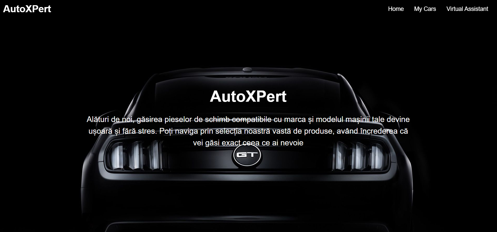
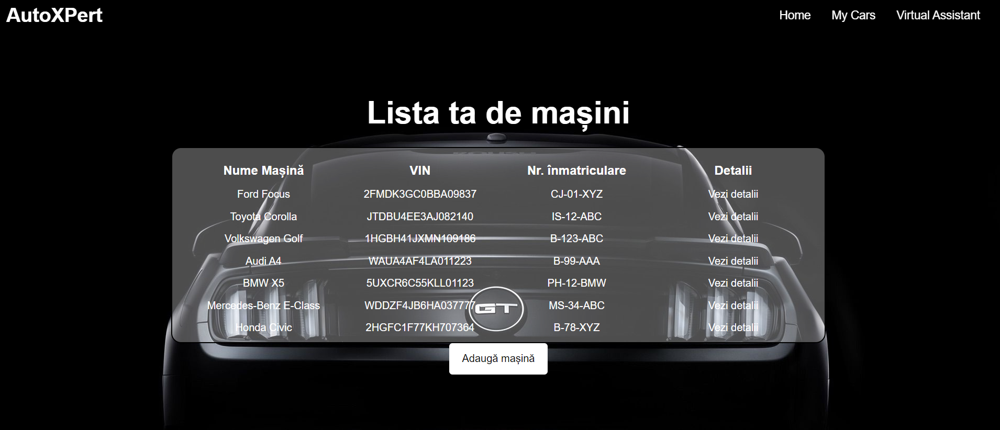
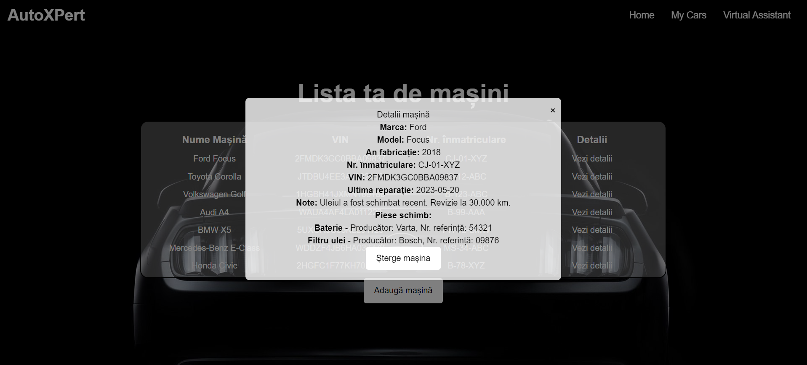
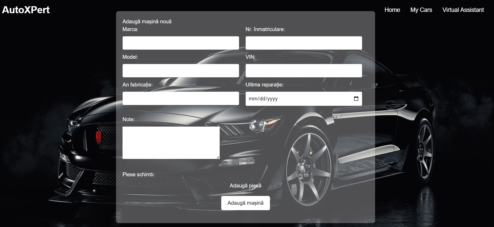
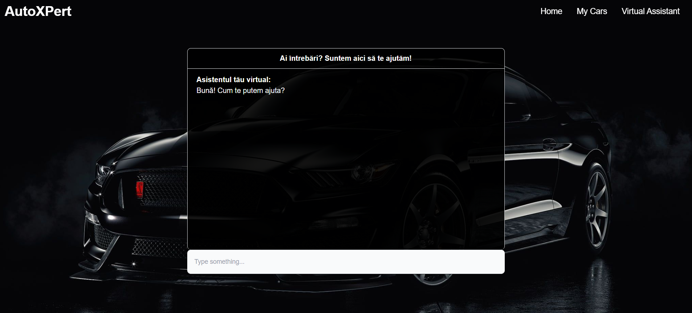

# Aplicație web - AutoXPert

SIMPRE
Student: Teodor Andrei-Cătălin
Grupa:   1133

# 1. Introducere
AutoXPert este o aplicație concepută pentru entuziaștii de automobile, oferindu-le o platformă intuitivă pentru gestionarea eficientă și organizată a mașinilor lor. Prin AutoXPert, utilizatorii pot crea liste personalizate pentru fiecare vehicul pe care îl dețin, adăugând detalii esențiale cum ar fi marca, modelul, anul fabricației, numărul de înmatriculare și altele.

## 1.1. Tehnologii folosite:
•	Next.js – servește drept fundație pentru construcția aplicației, asigurând o dezvoltare eficientă și performantă
•	MongoDB – pentru gestionarea datelor despre mașini și piese de schimb, AutoXPert utilizează baza de date NoSQL MongoDB
•	ChatGPT-API – pentru a oferi utilizatorilor o experiență personalizată și inteligentă, aceștia beneficiind astfel de răspunsuri rapide și precise la întrebările lor despre mașini și piese de schimb
•	Vercel – pentru găzduirea aplicației

# Link Github:
Linkul către repository-ul GitHub - https://github.com/TeodorVndrei/Proiect-CloudComputing

# Link Vercel:
Linkul către platforma Vercel - https://proiect-cloud-computing-ivory.vercel.app/

# Link Video:

# 2.Descriere problemă:
Aplicația oferă utilizatorilor posibilitatea de a gestiona eficient informațiile despre vehiculele lor printr-o singură listă personalizată. Această listă conține toate detaliile relevante despre fiecare mașină, inclusiv marca, modelul, anul fabricației, numărul de înmatriculare, codul VIN și, mai important, piesele de schimb compatibile.
Principalele funcționalități ale aplicației includ:
•	Gestionarea listei de vehicule – utilizatorii pot adăuga și șterge vehicule din lista lor personalizată, actualizând înregistrările cu informații noi sau modificând detaliile existente.
•	Gestionarea pieselor de schimb – utilizatorii pot adăuga și șterge piese de schimb pentru fiecare vehicul în parte, inclusiv numele piesei, producătorul și numărul de referință.
•	Vizualizarea detaliată – fiecare înregistrare în listă include informații detaliate despre mașină, cum ar fi ultima revizie, note relevante și ultima reparație efectuată.
Prin centralizarea acestor informații într-o singură locație, AutoXPert facilitează gestionarea și monitorizarea vehiculelor și a pieselor de schimb asociate, oferind o experiență integrată și eficientă.

# 3.Descriere API
Serviciul OpenAI - ChatGPT API furnizează o soluție pentru a adăuga capacitățile de conversație ale modelului de limbaj ChatGPT în diverse contexte. Acesta permite dezvoltatorilor să trimită cereri HTTP către serverele OpenAI pentru a primi răspunsuri în timp real de la modelul ChatGPT. 
```
            try {
                setIsLoading(true);
                const response = await fetch('/api/answer', {
                    method: 'POST',
                    headers: {
                        'Content-Type': 'application/json',
                    },
                    body: JSON.stringify({
                        messages: filteredChatHistory,
                        type: 'autoassist',
                    }),
                    signal: AbortSignal.timeout(20000),
                });
                const json = await response.json();

                setUserInput('');
                setIsLoading(false);

                const responseMessageObject = buildResponseMessageObject(json);
                setChatMessages(prevChatMessages => [...prevChatMessages, responseMessageObject]);
            }
            catch (error) {
                console.log(error);
            }
```
În codul de mai sus, se efectuează o cerere către un API (/api/answer) folosind metoda POST. Procesul începe prin activarea stării de încărcare, după care cererea este trimisă către API cu informațiile necesare. În plus, este configurat un semnal de anulare a cererii pentru a limita timpul de răspuns la 20 de secunde, utilizând AbortSignal.timeout(20000).

###De subliniez că această porțiune de cod reprezintă doar o parte din întreaga aplicație și nu reflectă în totalitate contextul general al acesteia.
```
const SYSTEM_PROMPTS = {
	SIMPLE_ASSISTANT: {
		MESSAGE: {
			'role': 'system',
			'content': 'You are a simple assistant. You respond with simple sentences.',
		},
		TEMPERATURE: 1,
		MAX_TOKENS: 50,
		TYPE: 'simple_assistant',
	},
	AutoAssist: {
		MESSAGE: {
			'role': 'system',
			'content': 'You are posing as a mechanic, offering practical aid to drivers by helping them find important details about their cars and compatible parts.',
		},
		TEMPERATURE: 1,
		MAX_TOKENS: 200,
		TYPE: 'autoassist',
	},
};
```
Configurația de mai sus descrie două tipuri de asistenți virtuali: 
•	SIMPLE_ASSISTANT este un asistent virtual simplu, care furnizează răspunsuri concise și directe. 
•	AutoAssist este un tip de asistent virtual care se prezintă ca un mecanic și oferă ajutor practic șoferilor, ajutându-i să găsească detalii importante despre mașinile lor și piese compatibile. 

# 4.Flux de date
În aplicația AutoXPert, sunt implementate trei tipuri de request-uri: GET, POST și DELETE. 

## 4.1.	GET
### 4.1.1.	Exemplu de request: http://localhost:3000/api/records
### 4.1.2.	Exemplu de response:
```
{
    "data": [
        {
            "_id": "6630f363268054c36160f0c3",
            "marca": "Ford",
            "model": "Focus",
            "an_fabricatie": 2018,
            "numar_inmatriculare": "CJ-01-XYZ",
            "VIN": "2FMDK3GC0BBA09837",
            "piese_schimb": [
                {
                    "nume": "Baterie",
                    "producator": "Varta",
                    "numar_referinta": "54321"
                },
                {
                    "nume": "Filtru ulei",
                    "producator": "Bosch",
                    "numar_referinta": "09876"
                }
            ],
            "note": "Uleiul a fost schimbat recent. Revizie la 30.000 km.",
            "ultima_reparatie": "2023-05-20"
        },
        {
            "_id": "6630f36b268054c36160f0c5",
            "marca": "Toyota",
            "model": "Corolla",
            "an_fabricatie": 2016,
            "numar_inmatriculare": "IS-12-ABC",
            "VIN": "JTDBU4EE3AJ082140",
            "piese_schimb": [
                {
                    "nume": "Luneta spate",
                    "producator": "Saint-Gobain",
                    "numar_referinta": "13579"
                },
                {
                    "nume": "Filtru combustibil",
                    "producator": "Mann",
                    "numar_referinta": "24680"
                }
            ],
            "note": "Schimbul de ulei a fost efectuat la 70.000 km.",
            "ultima_reparatie": "2022-11-10"
        },
```
## 4.2.	POST
### 4.2.1.	Exemplu de request pentru crearea unui obiect: 
http://localhost:3000/api/records
```
{
            "marca": "Mercedes-Benz",
            "model": "E-Class",
            "an_fabricatie": 2017,
            "numar_inmatriculare": "MS-34-ABC",
            "VIN": "WDDZF4JB6HA037777",
            "piese_schimb": [
                {
                    "nume": "Bujii",
                    "producator": "NGK",
                    "numar_referinta": "67890"
                },
                {
                    "nume": "Filtru de aer",
                    "producator": "Mann",
                    "numar_referinta": "12345"
                }
            ],
            "note": "Nivelul uleiului verificat la ultima revizie.",
            "ultima_reparatie": "2024-02-10"
}
```
### 4.2.2.	Exemplu de response pentru crearea unui obiect:
```
{
    "data": {
        "acknowledged": true,
        "insertedId": "663dfb39d4303203004c3bc9"
    }
}
```

### 4.2.3.	Exemplu de request pentru asistentul virtual:
http://localhost:3000/api/answer
```
{"messages": [
{"role": "user",
"content": "Am un Volkswagen Golf din 2015 cu acest VIN: 1HGBH41JXMN109186. Ce filtru de aer imi recomanzi care sa fie compatibil cu masina mea?"
}],
"type": "autoassist"}
```

### 4.2.4.	Exemplu de response din partea asistentului virtual:
```
{
    "data": {
        "index": 0,
        "message": {
            "role": "assistant",
            "content": "Pentru Volkswagen Golf din 2015 cu VIN-ul furnizat, cel mai probabil filtrul de aer compatibil este cel cu codul de piesă VW 1K0129620D. Acesta este un filtru de aer original recomandat pentru modelul Golf din acel an. Îți recomand să verifici și să te asiguri că acest filtru este compabil și recomandat pentru modelul exact al mașinii tale. Dacă ai nevoie de mai multe informații sau detalii specifice, nu ezita să întrebi."
        },
        "logprobs": null,
        "finish_reason": "stop"
    }
}
```

## 4.3.	DELETE
### 4.3.1.	Exemplu de request pentru ștergerea unui obiect: 
http://localhost:3000/api/records/?id=6630f36b268054c36160f0c8 - pe baza id-ului, mașina poate fi ștearsă din baza de date.

### 4.3.2.	Exemplu de response pentru ștergerea unui obiect: 
```
{
    "data": {
        "acknowledged": true,
        "deletedCount": 0
    }
}
```

## 4.4.	Autentificare și autorizare servicii utilizate
Autentificarea și autorizarea sunt esențiale în utilizarea atât a serviciilor MongoDB, cât și a celor de la OpenAI ChatGPT. În ceea ce privește MongoDB, am configurat un utilizator cu nume și parolă pentru autentificarea în baza de date și am setat permisiuni pentru a putea fi accesată din diverse adrese IP. Pentru accesul la serviciul ChatGPT, am creat un cont și am generat o cheie API, folosită pentru autentificare și autorizare. Pentru a garanta securitatea, fișierul .env care păstrează informațiile cheilor, nu a fost încărcat pe GitHub, iar variabilele de mediu au fost configurate în platforma Vercel, în zona de Environment Variables, pentru a gestiona cheile într-un mod sigur. Aceste măsuri asigură că accesul la serviciile utilizate este restricționat, iar informațiile sensibile sunt protejate împotriva accesului neautorizat.

# 5. Capturi ecran aplicație
## 5.1.	Pagina principala


Pagina principală, reprezentată de componenta MainPage, servește drept introducere și prezentare generală a serviciului "AutoXPert", în timp ce pagina de homepage oferă o prezentare mai detaliată a aplicației.

## 5.2.	Pagina Home


## 5.3.	Pagina My Cars


Conceptul principal al acestei pagini este de a oferi utilizatorilor o listă vizuală a mașinilor pe care le dețin, împreună cu informații esențiale despre fiecare mașină, precum marca, modelul, numărul de înmatriculare și numărul de identificare al vehiculului (VIN).



Utilizatorii pot vedea o prezentare generală a tuturor mașinilor lor pe această pagină, precum și detalii suplimentare despre fiecare mașină individual prin intermediul unui modal care apare la clic pe butonul "Vezi detalii". De asemenea, aceștia au la dispoziție posibilitatea de a șterge mașini din lista lor, folosind butonul "Șterge mașina”, această acțiune actualizând lista în timp real, eliminând mașina ștearsă din interfață. În plus, pagina include și un buton pentru adăugarea unei noi mașini, care redirecționează utilizatorul către o altă pagină sau componentă destinată adăugării de mașini noi în lista lor.

## 5.4.	Pagina Add Car


Prin intermediul unui formular structurat, utilizatorii pot completa informațiile necesare cu ușurință, iar în cazul mașinilor cu piese de schimb, aceștia au posibilitatea de a adăuga și detalii despre piesele respective. 

## 5.5.	Pagina Virtual Assistant


Pagina "Virtual Assistant" servește ca un ghid interactiv pentru utilizatori în ceea ce privește informațiile despre vehiculele lor și piesele compatibile. Utilizatorii pot adresa întrebări variate, de la specificații despre mașină la recomandări pentru piese de schimb.

 # 6. Concluzie
 În concluzie, AutoXPert oferă o experiență completă și prietenoasă utilizatorilor săi, facilitând gestionarea informațiilor despre mașinile lor. De la crearea și administrarea listelor de mașini până la interacțiunea cu un asistent virtual pentru a primi sfaturi și informații, această aplicație este concepută pentru a satisface nevoile și pasiunile entuziaștilor auto. 

# 7. Referințe
- https://lungu-mihai-adrian.gitbook.io/cloud-computing-2024-simpre
- https://nextjs.org/docs
- https://v2.tailwindcss.com/docs
- https://www.mongodb.com/docs/
- https://www.mongodb.com/docs/drivers/node/current/fundamentals/crud/
- https://platform.openai.com/docs/introduction


